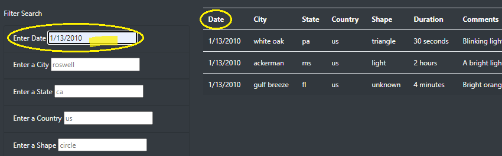
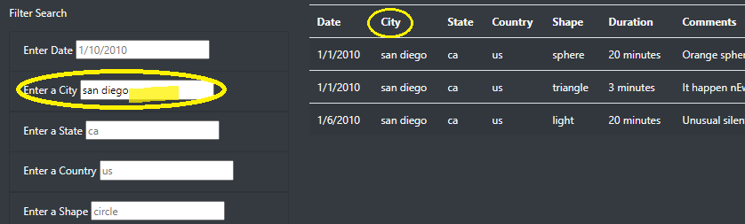
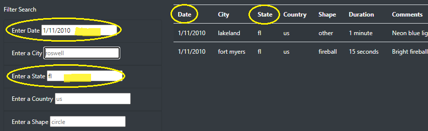
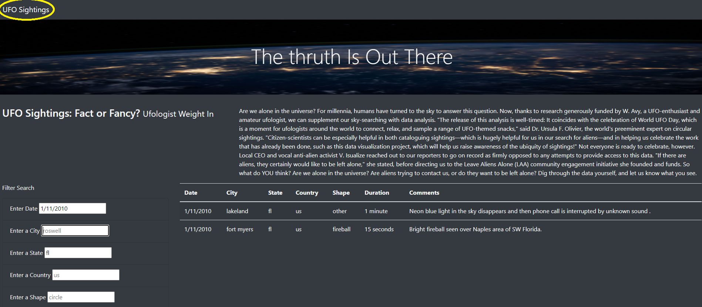

# UFOs https://dan-bas.github.io/UFOs/

## Overview
Gather and Display data as a table about UFO sightings using JavaScript and putting together in a HTML page. The info will be filter for multiple criteria at the same time. Date, city, state, country, and shape.

## Results  
In this HTML page the user can filter by one or multiple criteria. When the page is loaded, the entire data is showed and there is a menu to the left hand that shows the different categories that can be called. The user sees a title “Filter Search”. In the imagen below the data has been filtered by date. 

#### Filter by Date
The data has been filtered by date and giving the 1/13/2010. We can see there are three items matching the search consulted. 

#### Filter by City
In this imagen the data has been filtered by City. Giving the “san diego” criteria in City, we can see there are three items matching the search consulted. 

#### Filter by Date and State at the same time
In this imagen the data has been filtered by Date and State at the same time. Giving the 1/11/2010 and “fl” criteria in State, we can see there are two items matching the search consulted.

#### Returning to the whole Data.
In the imagen below is shown an option that the user can take by clicking the button “UFO Sightings”, located to the right top on the page. It allows to go back and see the whole data.

 
## Summary
The data searched in this app is easily accessible and the criteria works perfectly allowing to the user to find exactly what is needed. 
As any other data, there are some datapoints that does not exist and should be helpful to display an alert message saying that the table does not contain the information required. For example, for dates or countries.  
